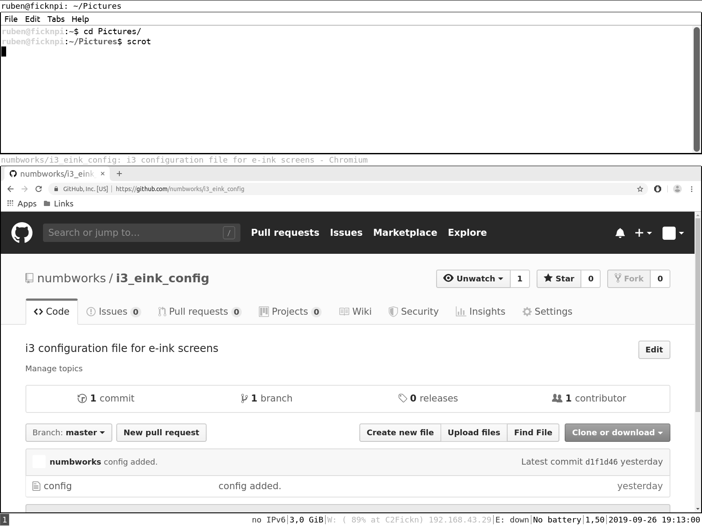

## i3 configuration file for e-ink screens (i3_eink_config)

Author: numbworks@gmail.com | Last update: 24.09.2019

If you are running the **i3 tiling manager** on an **eink screen**,  you might want to have a custom configuration file that is optimized for this kind of devices.

This configuration file is meant to be used in in conjuction with lxappearance => High Contrast, and other per-app settings.

This configuration file has been tested on:

- **Lubuntu** 16.04 and 18.04 
- **i3** 4.14.1-1
- **Dasung Paperlike Pro**

...but it should work just fine **on any other 13.3' e-ink screen** like the Onyx Boox Max 2 or 3.

#### Getting started guide:

```bash
$ sudo apt install i3
$ i3-config-wizard
```	

Select the modifier key ($mod) you prefere - for ex. the Windows key.

```bash
$ mkdir /home/<your_username>/Doduments/i3_eink_config
$ cd /home/<your_username>/Doduments/i3_eink_config
$ git clone https://github.com/numbworks/i3_eink_config.git
$ mv config /home/<your_username>/.config/i3/config
```
	
Reload the configuration file with: $mod+shift+c.
 
#### Screenshot:
 
 